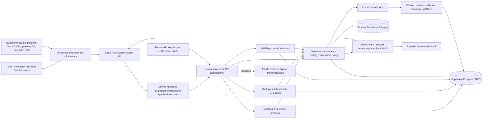

# VeriTrust Deep Project Analysis

**Analysis basis:** repository source at the time of analysis, not product copy or architectural claims. Where documentation and code disagree, this report treats executable code and current configuration as authoritative.

**Verification baseline:** `npm run check` passed across 29 application pages and 125 source files; `npm test` passed all 21 tests. The current module configuration is phishing **enabled**, link intelligence **enabled**, gateway **enabled**, and deepfake **disabled**.

## 1. Executive overview

VeriTrust is a static, multi-page security application hosted on Vercel. Browser pages are plain HTML/CSS/JavaScript; Vercel rewrites 56 meaningful `/api/*` routes into seven serverless aggregator functions. Those aggregators delegate to route modules and shared services. Supabase provides authentication, Postgres/PostgREST/RPC persistence, rate limits, job state, and private object storage. Hugging Face Router provides model inference. Stripe is optional billing infrastructure. A separate Node worker (or signed serverless worker handler) executes durable media, webhook, retention, privacy, telemetry, and outbox work.

The active detection surface has three main paths:

1. Simple phishing text classification or semantic extraction.
2. Malicious-link classification combined with deterministic URL rules.
3. Gateway/MailGraph orchestration, which parses email, evaluates authentication and identity evidence, runs parent and child models, correlates evidence, and applies a policy.

Deepfake image inference is implemented, including provider fallback and optional face cropping, but is currently disabled by `config/modules.json`. The configuration is enforced at the edge, in browser navigation, in server route guards, in API-key scope creation, in gateway routing, and in sitemap generation.

## 2. Repository structure

| Area | Contents | Architectural role |
|---|---|---|
| Root HTML | 29 application pages | Static page entry points and UI shells |
| `assets/js/core` | Config, session, site shell, scan launcher, reporting | Shared browser runtime |
| `assets/js/pages` | Page-specific controllers | UI events, API calls, polling, rendering |
| `api` | Seven Vercel functions | Serverless aggregation and dispatch |
| `lib/routes` | Account, billing, detection, email, gateway, system, v1 routes | HTTP boundary handlers |
| `lib/models` | Phishing, URL, deepfake adapters | Qualified provider contracts and inference normalization |
| `lib/gateway` | Contracts, policy, orchestration, persistence, jobs, uploads, webhooks | Multi-artifact security gateway |
| `lib/email` | Parsing, auth, identity, infrastructure, persistence, service | MailGraph forensic pipeline |
| `lib/learning` | Validation and repository | Learning platform data access |
| `worker` | Worker loop and media/webhook/retention handlers | Durable asynchronous execution |
| `config` | Runtime module flags and bundled model-contract canary | Deployment behavior gates |
| `docs` | Architecture, deployment, model, email, and schema descriptions | Supporting claims; non-authoritative when stale |
| `tests` | Seven test files, 21 tests | Configuration, model, correlation, UI, and auth checks |

No build-generated SPA bundle is involved. `vercel.json` serves clean static URLs and rewrites API paths to handlers. The Node engine is declared as version 24.

## 3. Relevant files analyzed

The repository validation script inventories 125 source/configuration/page files. The execution chains relevant to this report were traced through all seven API aggregators, all imported route handlers, shared authentication and persistence modules, all model adapters, gateway/email services, worker handlers, page controllers, current configuration, Vercel routing, tests, and the root HTML pages.

Highest-evidence files:

- Runtime topology: `vercel.json`, `middleware.ts`, `package.json`, `config/modules.json`, `lib/config.js`, `lib/modules.js`.
- Browser startup/auth: `assets/js/core/config.js`, `assets/js/core/site.js`, `assets/js/core/supabase-client.js`, `assets/js/pages/auth.js`.
- API dispatch: `api/account.js`, `api/billing.js`, `api/detection.js`, `api/gateway.js`, `api/learning.js`, `api/system.js`, `api/v1.js`.
- Auth/data boundary: `lib/browser-session.js`, `lib/supabase-server.js`, `lib/api-keys.js`, `lib/entitlements.js`, `lib/rate-limit.js`, `lib/veritrust-api.js`.
- Detection: `lib/detection-service.js`, `lib/link-intelligence.js`, `lib/model-contracts.js`, `lib/models/*.js`, `lib/routes/detection/*.js`, `lib/routes/v1/*.js`.
- Email/Gateway: every file under `lib/email`, every file under `lib/gateway`, `lib/routes/email/v2.js`, `lib/routes/gateway/worker.js`, `assets/js/pages/email-investigation.js`, `assets/js/pages/gateway.js`.
- Learning/billing/platform: `lib/learning/*.js`, `lib/routes/billing/*.js`, `lib/platform.js`, `lib/platform-worker.js`, `worker/**/*.js`.
- Verification: all seven files under `tests`, plus the repository check script invoked by `npm run check`.

## 4. Excluded or non-authoritative material

| Material | Treatment | Reason |
|---|---|---|
| `node_modules` | Excluded from project-flow analysis | Third-party implementation, not application source |
| Images and presentation-only CSS | Inspected only for ownership/context | No control-flow or data-flow responsibility |
| Product copy in README/docs | Cross-checked, never accepted alone | Several claims are stale relative to code/config |
| `docs/database-schema.json` | Used as an inventory claim only | The referenced SQL migrations are absent |
| External deployed Supabase state | Not verified | No live project credentials or database inspection was required/provided |
| Provider behavior beyond code contracts | Not inferred | The report describes requests and validation present in source |

## 5. Entry points

There are thirteen practical entry-point classes:

1. Root marketing and documentation HTML pages.
2. `/auth` sign-in, sign-up, callback, recovery, password, and logout actions.
3. Protected browser pages loaded through `site.js`.
4. Browser phishing text/EML workbench submissions.
5. Browser link-check submissions.
6. Browser gateway submissions and uploads.
7. Developer v1 bearer-key API requests.
8. Learning catalog, enrollment, lesson, assessment, certificate, and admin actions.
9. Internal email receiver events authenticated with a receiver secret.
10. Stripe webhook events authenticated with a signature.
11. Customer webhook deliveries emitted from queued work.
12. Signed `/api/gateway-worker` execution.
13. Long-running or one-shot `worker/index.js` execution.

## 6. Startup and initialization flow

1. Vercel resolves a clean URL or rewrite and applies security headers.
2. `middleware.ts` checks learning-preview protection and disabled-module paths before page delivery.
3. The HTML page loads `assets/js/core/config.js`.
4. The browser synchronously requests `/api/client-config`; if unavailable, it falls back to `/config/modules.json`.
5. Module flags remove disabled navigation/content and can redirect a disabled page to `/detection`.
6. `site.js` applies shared navigation and page-access behavior.
7. A protected page consumes any auth callback, resolves the server-managed session, and redirects unauthenticated users to `/auth?redirect=…`.
8. The page-specific module binds events and calls the relevant API.

Serverless requests do not share an application bootstrap singleton. Each aggregator imports its route modules and resolves environment-backed configuration at request time/module load according to Node caching.

## 7. User journey

| Journey | Page/API progression | Terminal state |
|---|---|---|
| Visitor | Home → detection chooser/docs/model pages | Learn or sign in |
| New user | Auth signup → optional email confirmation → session | Default profile/workspace provisioned on first authenticated context |
| Returning user | Auth signin → HttpOnly cookies → safe redirect | Protected dashboard/module |
| Phishing analyst | `/phishing` → text or EML → MailGraph API → result/evidence | Gateway decision and evidence |
| Link analyst | `/link-check` → normalize URL → Swift + rules | Safe/suspicious/phishing/malicious result |
| Gateway operator | Upload/register if needed → submit idempotent scan → poll/history/review | Policy decision and audit trail |
| Developer | Create scoped key → call `/api/v1/*` | Metered response and usage record |
| Learner | Preview gate → catalog → enroll → lesson → assessment | Progress and optional certificate |
| Administrator | Account/billing/API keys/learning admin/gateway policy | Governed organization state |

## 8. Authentication and authorization

### Browser authentication

`/api/auth-session` is the browser authentication boundary. Access and refresh tokens are stored in `veritrust_access` and `veritrust_refresh` HttpOnly cookies with `SameSite=Lax`; production cookies are Secure. The refresh cookie has a 30-day maximum age; access-cookie life is bounded to the token expiry. Browser code keeps only an in-memory sanitized session and does not use `localStorage` or `sessionStorage` for credentials.

Supported actions:

- `signin`: network- and account-keyed database rate limits, Supabase password grant, cookies.
- `signup`: password length 12–128, signup throttling, metadata, and optional email-confirmation state.
- `session`: verify access token, refresh on 401/403, rotate cookies, clear invalid refresh state.
- `callback`: receive fragment tokens after the browser removes them from history, verify them server-side, then set cookies.
- `password`: update through the authenticated Supabase user endpoint.
- `logout`: best-effort upstream logout and unconditional local cookie clearing.
- Password recovery: direct browser call to Supabase's anonymous recovery endpoint, returning to `/auth`.

`getProfileContext()` verifies the user, ensures a profile/default workspace if needed, and requires active organization membership. It returns organization, role, and plan context used by route authorization.

### Developer API authentication

API keys are generated as `vtg_live_*` or `vtg_test_*`. Only a SHA-256 hash, prefix, and display mask are stored; the raw secret is returned once. Requests require `Authorization: Bearer vtg_*`, active-key lookup, an enabled-module scope, entitlement, and quota reservation. Owner/admin permission is required for management scopes.

### Gateway authentication

Gateway actions accept either a browser Supabase context or an integration API key, then authorize a named action. Internal receiver requests additionally require a constant-time checked secret of at least 32 characters.

### Learning preview authentication

The preview layer is distinct from user authentication. A successful access-key check sets `veritrust_learning_access`, a `SameSite=Strict`, HttpOnly cookie containing version, expiry, nonce, and HMAC-SHA256 signature for eight hours. Personalized learning still requires a user session.

### Notable behavior

When browser session verification fails transiently, `site.js` can leave the protected page shell visible instead of redirecting. Protected APIs still enforce authentication, so this is a presentation-level fail-open, not a server-data authorization bypass.

## 9. Routing and module gates

`vercel.json` defines 73 rewrites, including 57 `/api/*` rewrites. One is a deliberate `/api/_(.*)` not-found trap, leaving 56 meaningful `/api/*` routes. `/sitemap.xml` and `/internal/v2/phishing/receiver-event` add two non-`/api` dynamic routes.

Current module gates:

| Module | Current state | Enforced by |
|---|---:|---|
| Phishing | Enabled | Browser config, API guard, scopes, sitemap |
| Link intelligence | Enabled | Browser config, API guard, scopes, sitemap |
| Gateway | Enabled | Browser config, API guard, scopes, sitemap |
| Deepfake | **Disabled** | Middleware, browser config, API guards, scopes, gateway router, sitemap |

The same gate is checked in multiple layers. This is defense-in-depth and also prevents disabled scopes from being minted. It is not merely a hidden navigation item.

## 10. Frontend architecture

The frontend is a static multi-page application. Each page owns a small controller and uses shared core modules rather than a framework router.

| Browser component | Responsibility |
|---|---|
| `config.js` | Runtime endpoints/module flags; hides or redirects disabled features |
| `site.js` | Shared navigation, access metadata, callback/session resolution |
| `supabase-client.js` | Same-origin server-session facade and in-memory session |
| `scan-launcher.js` | Shared detection submission behavior |
| `reporting.js` / `result-dialog.js` | Result presentation and report UI |
| `email-investigation.js` | Text/EML workbench and MailGraph response rendering |
| `gateway.js` | Signed uploads, scan submission, polling, history, review |
| `learning-api.js` and learning page modules | Catalog/progress/assessment/certificates/admin |

The phishing page's `data-email-workbench` activates `email-investigation.js`, replacing the older simple form path. The receiver tab provides integration guidance; browsers do not submit receiver events directly.

## 11. Backend architecture

Seven Vercel functions reduce the platform's function count:

| Aggregator | Dispatch domains |
|---|---|
| `api/account.js` | Session snapshot, auth actions, profile, scans, dashboard, cases, API keys, privacy, jobs |
| `api/billing.js` | Checkout, portal, subscription snapshot, Stripe webhook |
| `api/detection.js` | Browser phishing, link check, deepfake |
| `api/gateway.js` | Gateway scans/uploads/reports/policies/webhooks/reviews/operations/worker and email v2 |
| `api/learning.js` | Verification, catalog, learner progress, assessment, certificates, administration |
| `api/system.js` | Client config, health, model cards, sitemap, learning-access |
| `api/v1.js` | Developer phishing, link, deepfake, usage |

Shared boundary behavior includes request IDs, CORS/origin checks, method checks, body limits, module checks, structured errors, and response sanitization. Route services then call Supabase, providers, or queue work.

## 12. API architecture

The browser APIs use same-origin cookies. Developer v1 uses bearer API keys. Gateway supports both user and integration contexts. Stripe, worker, and receiver endpoints use purpose-specific signatures/secrets.

Common error statuses are 400, 401, 403, 404, 409, 413, 415, 429, and 500/502/503 depending on validation, authorization, idempotency, limits, configuration, or provider failure. Public model failures are not converted into benign results.

Idempotency is a first-class gateway and MailGraph contract. A reused key with the same canonical request returns the existing scan; a different request hash yields a conflict. Developer usage is reserved before inference and finalized with status/billable units afterward.

## 13. Major modules

| Module | Inputs | Core processing | Outputs | State |
|---|---|---|---|---|
| Identity/account | Credentials, cookies, profile/case actions | Auth, membership, role and plan checks | Session/profile/cases/jobs | Active |
| Billing/entitlements | Plan, interval, Stripe event | Checkout/portal and atomic subscription sync | Subscription/entitlement state | Optional Stripe config |
| Simple phishing | Text, selected model | MailGuard classification or Cortex semantic extraction | Verdict/evidence/result | Active |
| Link intelligence | URL/text | URL rules + Swift classifier + weighted combination | Label/risk/confidence | Active |
| Deepfake | Image | Pixel/Prism classifier and fallback | Real/fake probability | **Disabled** |
| MailGraph | Plain text, EML, receiver object | MIME/auth/identity/infrastructure + parent/child models | Gateway evidence and decision | Active |
| Gateway | Multi-artifact content and policy | Idempotency, routing, correlation, policy | Report/review/webhook | Active |
| Learning | Catalog/progress/assessment/admin actions | Preview, learner auth, validation, repository/RPC | Progress/certificate | Active |
| Platform operations | Privacy, retention, telemetry, inference jobs | Lease-backed worker execution | Job receipts/audit | Active when configured |
| Developer platform | Keys/scopes/quotas/v1 scan | Hash auth, reservation, model adapter | Metered API response | Active per entitlement |

## 14. Detection pipelines

### Simple phishing

The browser route accepts JSON no larger than 16 KiB and text between 8 and 12,000 characters. It resolves the selected model (`mailguard` or `cortex`), validates profile context and rate limits, and runs a persisted scan lifecycle. The developer adapter uses equivalent model services but records metered usage rather than the standard browser lifecycle.

MailGuard is authoritative classification. Cortex is non-authoritative structured semantic extraction and always returns `UNCERTAIN` with null probability-derived confidence/risk.

### Link intelligence

The service accepts a direct URL or extracts the first HTTP(S) URL from text. It validates and canonicalizes the URL, runs deterministic indicators, invokes Swift, combines model and rules, and persists/finalizes according to browser or developer context. Sentinel is represented as locked/coming soon and cannot be selected for active execution.

### MailGraph

Plain text or EML enters a gateway-authenticated, idempotent scan. EML parsing has explicit limits: 10 MiB raw input, 256 KiB headers, nesting depth 10, 100 parts, 25 MiB decoded total, 10 MiB attachment, 1 MiB normalized HTML, and a five-second parse timeout. Attachments are metadata-only and never executed.

The pipeline extracts content and URLs, evaluates SPF/DKIM/DMARC/ARC where raw material exists, builds identity relationships, parses infrastructure hops, runs MailGuard on the parent and Swift on child URLs, persists evidence, then correlates all sources through the gateway policy.

### Deepfake

The implemented route validates JPEG/PNG/WebP/BMP magic bytes and a 4 MiB limit, optionally uses an external face-crop service in the v1/browser path, invokes a qualified binary image classifier, and tries the alternative qualified deepfake model on failure. It does not contain a video-frame or audio-analysis pipeline. All entry points are currently disabled by configuration.

## 15. Model pipelines and contracts

Model contracts require registry schema `gateway-model-registry-2`, provider/task compatibility, a repository identifier, a 40–64 hex revision, and a production/canary qualification state. MailGuard additionally requires an ordered label map. `HF_MODEL_CONTRACTS` can provide deployment contracts; the bundled canary is accepted only through the exact legacy canary path.

| Alias | Task | Active use | Output normalization | Fallback |
|---|---|---|---|---|
| MailGuard | Text classification | Simple phishing, MailGraph, gateway text | Exact benign/phishing label set and probability sum | None |
| Cortex | Chat/semantic JSON | Optional simple phishing semantic mode | Strict schema, enums, and evidence spans | None |
| Swift | URL/text classification | Link-check, child URLs, gateway URLs | benign/phishing/malware/defacement | None |
| Pixel | Binary image classification | Deepfake image only | real/fake probabilities | Prism on provider/model failure |
| Prism | Binary image classification | Deepfake image only | real/fake probabilities | Pixel on provider/model failure |

Hugging Face requests disable the active model cache where specified and request complete label distributions. A provider/model contract error fails the request; MailGuard and Swift do not cascade to another model or a local heuristic verdict.

## 16. Confidence and risk logic

### MailGuard

- `p_phish >= 0.70` → `LIKELY_PHISHING`.
- `p_phish <= 0.20` → `LIKELY_BENIGN`.
- Otherwise → `UNCERTAIN`.
- Confidence is `max(p_phish, p_benign)`.
- Risk labels derive from phishing probability: Critical ≥ .90, High ≥ .75, Medium ≥ .45, otherwise Low.
- Confidence bands are Strong ≥ .85, Moderate ≥ .65, otherwise Weak.

The phishing finalizer preserves the raw `model_score`, computes an independent deterministic `rule_score`, and produces a conservative `decision_score` through `combinePhishingScores()`. A benign state is withheld when deterministic evidence materially disagrees with the model.

### Link intelligence

Deterministic indicators include shorteners, IP hosts, punycode, long/hyphenated/deep domains, suspicious TLDs, non-HTTPS, sensitive terms, brand impersonation, redirect parameters, embedded URLs, and random-looking tokens. Rule score combines maximum severity, accumulated weight, and density.

The primary combined score is `0.62 × model + 0.38 × rules`, followed by evidence-dependent floors and a low-risk cap. Final labels are malicious, phishing, suspicious, or safe according to score and supporting model/indicator evidence. Confidence is the maximum of model confidence, combined risk, and inverse combined risk. These values are heuristic/probability-derived and are not presented in code as calibrated real-world probabilities.

### Gateway correlation

The gateway begins with the maximum completed route score, then applies deterministic floors for credential requests, visible-link mismatches, obfuscation, redirects/bidirectional controls, confusables, and combinations. Required-route failure can produce unknown/manual-review behavior according to policy. Policy thresholds map risk to allow, warn, manual review, quarantine, or block; advisory mode can prevent automatic blocking.

## 17. JSON and response contracts

### Common response concepts

| Field | Meaning |
|---|---|
| `request_id` | Cross-boundary correlation identifier |
| `scan_id` | Persisted scan identifier where applicable |
| `status` | Lifecycle or route status |
| `scan_type` | Phishing, link, deepfake, gateway, or email context |
| `model` / `scores` | Normalized model metadata and probability/score fields |
| `result` / `gateway_decision` | Human/actionable outcome |
| `evidence` | Deterministic, model, authentication, identity, or route evidence |
| `usage` | Developer reservation/final billable-unit view |
| `error` | Safe public error; internal provider details are reduced |

Browser phishing/link responses include the persisted result and model/rule detail. Developer v1 responses add creation time and usage. MailGraph returns `{ok, request_id, scan_id, status, gateway_decision, evidence}`. Gateway scan/report endpoints expose lifecycle, artifacts/routes/evidence, policy decision, and review state as authorized.

The shared response scrubber removes keys such as `hf_model`, `model_path`, and `provider_model`. It does **not** remove `repository_id` or `revision_sha`, and active detection payloads include those fields inside model metadata. This is a confirmed mismatch with documentation claiming provider repository identifiers never appear in public scan payloads.

## 18. Database and storage

Supabase is the system of record. Runtime code references these domains:

| Domain | Representative data |
|---|---|
| Identity | profiles, organizations, memberships, roles, plans |
| Detection | scans, inputs, model runs, results |
| Investigation | cases, evidence, decisions, events |
| Developer | API keys, scopes, usage reservations/finalization |
| Billing | customers, subscriptions, events/outbox, entitlements |
| Gateway | scans, artifacts, routes, evidence, policies, reviews, uploads, webhooks, jobs |
| Email | message details, auth results, identity graph, infrastructure hops |
| Learning | courses, enrollments, lessons, events, attempts, certificates |
| Platform | privacy jobs, retention, operational jobs, telemetry rollups |

`avatars` and private `gateway-uploads` are the material storage buckets used in runtime source. Gateway objects use signed upload/download behavior and retention receipts. Raw EML retention is capped to 24 hours by the MailGraph service.

`docs/database-schema.json` claims 79 public tables, 901 columns, 30 enums, 519 constraints, 73 indexes, 59 routines, two views, 44 triggers, 66 policies, eight buckets, and three pgmq queues. The repository does not include the referenced migration SQL, so those counts and deployed RLS/constraints cannot be independently verified from this checkout.

## 19. Error handling and alternate paths

| Condition | Implemented behavior |
|---|---|
| Disabled module | Middleware 404/redirect; server route guard; scope/routing omission |
| Missing/invalid browser session | 401 or redirect to auth; refresh attempted before failure |
| Invalid API key/scope/entitlement | 401/403; no inference |
| Rate/quota exhausted | 429 or quota error; usage not treated as success |
| Invalid content/type/size | 400/413/415 before provider call |
| Duplicate idempotency key/same request | Existing scan returned |
| Duplicate key/different request | 409 conflict |
| Provider contract/output invalid | Model failure; never benign fallback |
| MailGuard/Swift provider failure | No alternate model; error/failed evidence |
| Deepfake selected-model failure | Try the other qualified image model, then fail |
| Face-crop failure | Use original image |
| Mail parse limit/timeout | Partial/truncated/failed evidence state; not benign |
| Required gateway route fails | Apply policy fail mode/unknown/manual review |
| Worker transient failure | Lease release and bounded retry |
| Worker terminal failure | Failed/dead-letter-style state with audit trail |
| Webhook destination unsafe | Refuse delivery before network call |

## 20. External integrations

| Integration | Purpose | Trust boundary |
|---|---|---|
| Supabase Auth | Password auth, recovery, token verification/refresh | Server-managed cookies; anon/service credentials separated |
| Supabase PostgREST/RPC | Transactional application data | Service/user context and application authorization |
| Supabase Storage | Avatars and private uploaded artifacts | Signed URL/object path plus retention |
| Hugging Face Router | Text, URL, image inference and semantic chat | Qualified pinned contracts; normalized output validation |
| Stripe | Checkout, portal, subscription synchronization | Server secret and signed webhook |
| Face-crop service | Optional deepfake pre-processing | Output capped/validated; original image fallback |
| Customer webhooks | Gateway decision delivery | Destination allowlist/public DNS, encrypted secret, HMAC signature |
| `mailauth`, `mailparser`, `tldts` | Local email/domain analysis | Resource caps and trusted-boundary logic |

## 21. Master Mermaid diagram

The canonical editable source is [`master-system-flowchart.mmd`](master-system-flowchart.mmd), with a high-resolution rendering at [`master-system-flowchart.png`](master-system-flowchart.png).

The standalone master contains the full gates, browser routes, auth modes, aggregators, pipelines, external services, storage, worker, and error branches.

## 22. Module flowcharts

| Diagram | Mermaid source | PNG |
|---|---|---|
| Authentication and preview access | [`authentication-flow.mmd`](module-flowcharts/authentication-flow.mmd) | [`authentication-flow.png`](module-flowcharts/authentication-flow.png) |
| Frontend startup/navigation | [`frontend-navigation-flow.mmd`](module-flowcharts/frontend-navigation-flow.mmd) | [`frontend-navigation-flow.png`](module-flowcharts/frontend-navigation-flow.png) |
| Backend/API dispatch | [`backend-api-flow.mmd`](module-flowcharts/backend-api-flow.mmd) | [`backend-api-flow.png`](module-flowcharts/backend-api-flow.png) |
| Simple phishing | [`phishing-flow.mmd`](module-flowcharts/phishing-flow.mmd) | [`phishing-flow.png`](module-flowcharts/phishing-flow.png) |
| Link intelligence | [`link-intelligence-flow.mmd`](module-flowcharts/link-intelligence-flow.mmd) | [`link-intelligence-flow.png`](module-flowcharts/link-intelligence-flow.png) |
| Deepfake disabled/current-vs-enabled | [`deepfake-disabled-flow.mmd`](module-flowcharts/deepfake-disabled-flow.mmd) | [`deepfake-disabled-flow.png`](module-flowcharts/deepfake-disabled-flow.png) |
| MailGraph email forensics | [`mailgraph-email-flow.mmd`](module-flowcharts/mailgraph-email-flow.mmd) | [`mailgraph-email-flow.png`](module-flowcharts/mailgraph-email-flow.png) |
| Gateway orchestration | [`gateway-flow.mmd`](module-flowcharts/gateway-flow.mmd) | [`gateway-flow.png`](module-flowcharts/gateway-flow.png) |
| Storage and data domains | [`storage-data-flow.mmd`](module-flowcharts/storage-data-flow.mmd) | [`storage-data-flow.png`](module-flowcharts/storage-data-flow.png) |
| Learning | [`learning-flow.mmd`](module-flowcharts/learning-flow.mmd) | [`learning-flow.png`](module-flowcharts/learning-flow.png) |
| Durable worker | [`worker-flow.mmd`](module-flowcharts/worker-flow.mmd) | [`worker-flow.png`](module-flowcharts/worker-flow.png) |
| End-to-end data lifecycle | [`end-to-end-data-flow.mmd`](module-flowcharts/end-to-end-data-flow.mmd) | [`end-to-end-data-flow.png`](module-flowcharts/end-to-end-data-flow.png) |

## 23. Source-to-flow mapping

| Flow node | Primary source evidence |
|---|---|
| Vercel delivery/rewrites | `vercel.json`, `middleware.ts` |
| Browser configuration/gating | `assets/js/core/config.js`, `config/modules.json`, `lib/modules.js` |
| Page access/navigation | `assets/js/core/site.js`, root HTML page metadata |
| Browser session | `assets/js/core/supabase-client.js`, `lib/browser-session.js` |
| Auth actions | `lib/routes/account/auth-session.js`, `api/account.js` |
| Profile/workspace context | `lib/supabase-server.js` |
| API key auth and metering | `lib/api-keys.js`, `lib/entitlements.js`, `lib/routes/v1/*.js` |
| Simple phishing | `lib/routes/detection/phishing.js`, `lib/detection-service.js`, `lib/models/phishing-text.js` |
| Link intelligence | `lib/routes/detection/link-check.js`, `lib/link-intelligence.js`, `lib/models/malicious-url.js` |
| Deepfake | `lib/routes/detection/deepfake.js`, `lib/models/deepfake-image.js`, `lib/routes/v1/deepfake.js` |
| MailGraph | `lib/routes/email/v2.js`, all `lib/email/*.js` |
| Gateway submission | `lib/gateway/contracts.js`, `orchestrator.js`, `router.js`, `policy.js` |
| Gateway correlation | `lib/gateway/correlation.js`, `lib/risk-engine.js` |
| Upload/storage/retention | `lib/gateway/uploads.js`, `storage.js`, `worker/handlers/retention.js` |
| Webhook delivery | `lib/gateway/webhooks.js`, `worker/handlers/webhook.js` |
| Worker leases/retries | `worker/index.js`, `lib/gateway/worker-store.js`, `lib/platform-worker.js` |
| Learning | `api/learning.js`, `lib/learning/repository.js`, `lib/learning/validation.js` |
| Billing | `api/billing.js`, `lib/billing.js`, `lib/routes/billing/*.js` |

## 24. File responsibility map

| File or family | Responsibility |
|---|---|
| `vercel.json` | Headers, function limits, clean URLs, page/API rewrites |
| `middleware.ts` | Learning-preview and disabled-module edge enforcement |
| `config/modules.json` | Current feature truth |
| `lib/config.js` | Environment/config access and validation |
| `lib/modules.js` | Server module guards and filtered capabilities |
| `assets/js/core/config.js` | Browser module/endpoints bootstrap |
| `assets/js/core/site.js` | Shared page access and navigation |
| `assets/js/core/supabase-client.js` | Browser server-session facade |
| `assets/js/pages/auth.js` | Sign-in/up/recovery UI |
| `assets/js/pages/email-investigation.js` | MailGraph workbench |
| `assets/js/pages/link-check.js` | Link-check UI |
| `assets/js/pages/gateway.js` | Upload, scan, poll, review UI |
| `assets/js/pages/assessment.js` | Assessment start/save/submit UI |
| `assets/js/pages/lesson.js` | Lesson/progress UI |
| `api/*.js` | Seven request dispatchers |
| `lib/browser-session.js` | Cookie parsing/set/clear and Supabase token lifecycle |
| `lib/supabase-server.js` | Supabase calls and authenticated profile context |
| `lib/veritrust-api.js` | Shared HTTP/JSON/CORS/provider helpers and response scrubber |
| `lib/validators.js` | Shared input validators |
| `lib/rate-limit.js` | Database-backed throttling |
| `lib/api-keys.js` | API key generation/hash lookup/scopes |
| `lib/entitlements.js` | Plan limits, reservations, final usage |
| `lib/model-contracts.js` | Qualified, pinned provider contract validation |
| `lib/detection-service.js` | Phishing orchestration, thresholds, normalized payload |
| `lib/link-intelligence.js` | URL indicators and rule/model combination |
| `lib/models/*.js` | Gateway-compatible inference adapters |
| `lib/email/parser.js` | Resource-bounded MIME parsing |
| `lib/email/auth.js` | SPF/DKIM/DMARC/ARC analysis |
| `lib/email/identity.js` | Identity/domain graph and confusable analysis |
| `lib/email/infrastructure.js` | Received-hop parsing/enrichment hooks |
| `lib/email/content.js` | Content observations and URLs |
| `lib/email/service.js` | MailGraph end-to-end service |
| `lib/gateway/contracts.js` | Strict gateway request schemas |
| `lib/gateway/idempotency.js` | Canonical request replay/conflict behavior |
| `lib/gateway/orchestrator.js` | Artifact routing and lifecycle |
| `lib/gateway/router.js` | Module-aware model route selection |
| `lib/gateway/policy.js` | Policy schema/thresholds |
| `lib/gateway/correlation.js` | Evidence-to-risk/decision correlation |
| `lib/gateway/persistence.js` | Gateway records/evidence/events |
| `lib/gateway/uploads.js` | Signed upload registration/completion |
| `lib/gateway/storage.js` | Private object operations/retention |
| `lib/gateway/webhooks.js` | Webhook config and security material |
| `lib/gateway/worker-store.js` | Job claim/lease/retry persistence |
| `worker/index.js` | Durable worker scheduling loop |
| `worker/handlers/*.js` | Media, webhook, retention execution |
| `lib/learning/*.js` | Learning validation/data repository |
| `lib/platform*.js` | Privacy, telemetry, retention, inference, outbox jobs |
| `tests/*.test.js` | Configuration/model/correlation/UI/auth invariants |

## 25. API endpoint summary

The 56 meaningful `/api/*` rewrites plus two other dynamic routes are:

| Domain | Public routes | Methods/behavior |
|---|---|---|
| System | `/api/client-config`, `/api/health`, `/api/model-cards`, `/api/learning-access`, `/sitemap.xml` | Config/cards/sitemap read; health shallow or secret-backed diagnostics; learning-access GET/POST/DELETE |
| Account | `/api/session`, `/api/auth-session`, `/api/profile`, `/api/scans`, `/api/dashboard`, `/api/cases`, `/api/api-keys`, `/api/privacy`, `/api/jobs` | Session/auth; CRUD/action semantics per resource; protected except auth actions |
| Browser detection | `/api/phishing`, `/api/link-check`, `/api/deepfake` | POST; deepfake currently 404-disabled |
| Developer | `/api/v1/phishing`, `/api/v1/link-check`, `/api/v1/deepfake`, `/api/v1/usage` | Bearer key; scan POST and usage GET; deepfake disabled |
| Email v2 | `/api/v2/phishing/analyze-text`, `/api/v2/phishing/analyze-eml`, `/api/v2/phishing/evidence/:id` | Gateway-authenticated submit/read |
| Receiver | `/internal/v2/phishing/receiver-event` | Secret-authenticated internal event |
| Gateway scans | `/api/v1/gateway/scans`, `/api/v1/gateway/scans/:id`, `/api/v1/gateway/scans/:id/cancel`, `/api/v1/gateway/reports/:id` | Create/list/read/cancel/report |
| Gateway uploads | `/api/v1/gateway/uploads`, `/api/v1/gateway/uploads/:id/complete` | Register signed upload and complete |
| Gateway policy | `/api/v1/gateway/policies`, `/api/v1/gateway/policies/:id/activate` | List/create/update/activate as authorized |
| Gateway webhooks | `/api/v1/gateway/webhooks`, `/api/v1/gateway/webhooks/:id/test`, `/api/v1/gateway/webhooks/:id/disable` | Configure/test/disable |
| Gateway review/ops | `/api/v1/gateway/reviews`, `/api/v1/gateway/reviews/:id/resolve`, `/api/v1/gateway/operations`, `/api/gateway-worker` | Queue/review resolution/operational views/signed worker |
| Learning | `/api/learning/verify/:code`, `/api/learning/courses/:slug`, `/api/learning/catalog`, `/api/learning/me`, `/api/learning/enrollments`, `/api/learning/enrollments/:id`, `/api/learning/lessons/:id`, `/api/learning/events`, `/api/learning/assessments/:id/start`, `/api/learning/attempts/:id`, `/api/learning/attempts/:id/response`, `/api/learning/attempts/:id/submit`, `/api/learning/certificates`, `/api/learning/admin` | Public verification; preview-gated catalog; authenticated learner/admin mutations |
| Billing | `/api/billing/checkout`, `/api/billing/portal`, `/api/billing/subscription`, `/api/billing/webhook` | Protected owner/admin/user views; signed raw-body Stripe webhook |

`/api/_(.*)` is not a functional endpoint; it deliberately maps private/underscore-like API paths to not-found.

## 26. Model summary

| Pipeline | Input | Provider request | Validation | Decision source |
|---|---|---|---|---|
| MailGuard | 8–12,000 character text | HF text classification, softmax/all labels | Qualified revision, exact labels, sum tolerance | Phishing probability thresholds |
| Cortex | Text | HF chat completion requesting strict JSON | Contract, JSON schema, enums, evidence spans | Always uncertain; semantic evidence only |
| Swift | Canonical URL/text | HF classification | Qualified contract and four normalized labels | Weighted model/rules plus evidence floors |
| Pixel/Prism | Valid image bytes | HF binary image classification | Image type/size, qualified contract, normalized real/fake | Larger real/fake probability; risk from fake |
| MailGraph | Text/EML | Parent MailGuard + child Swift, plus local evidence | MIME/auth/identity limits and route states | Gateway correlation/policy |

The canary contract pins MailGuard to a specific repository revision and thresholds. Repository identifiers/revisions are deployment contracts, not dynamically selected user input.

## 27. Data contract summary

| Boundary | Accepted shape | Important limits | Persisted result |
|---|---|---|---|
| Browser phishing | JSON `{text, model}` | 16 KiB body; text 8–12k | Scan/input/model run/result |
| Browser link | JSON URL/text and model | 16 KiB body; URL validation; text cap | Scan/input/model run/result |
| Browser deepfake | Multipart image | 4 MiB; JPEG/PNG/WebP/BMP | Disabled now; scan lifecycle if enabled |
| Developer scans | Bearer auth + scan input | Scope/entitlement/quota | Usage reservation/finalization; response payload |
| MailGraph text | JSON + idempotency key | Text/schema limits | Gateway scan/email artifact/evidence |
| MailGraph EML | `message/rfc822` + idempotency key | 10 MiB raw plus parser sub-limits | Private object ≤24h + email evidence |
| Gateway scan | `{source, content, processing_mode, metadata}` | text 12k, URL 20, media 10, metadata 16 KiB | Scan/artifacts/routes/evidence/decision |
| Gateway upload | Registration metadata then signed PUT | Declared type/size/path rules | Upload/object/retention state |
| Learning | Resource/action-specific JSON | Preview, learner, entitlement, validation | Enrollment/progress/attempt/certificate |
| Worker job | Lease-backed typed payload | Claim/heartbeat/retry constraints | Receipt, evidence, delivery, or failure |

## 28. Claimed versus implemented

| Claim/source | Implemented truth | Assessment |
|---|---|---|
| README module example sets deepfake true | `config/modules.json` sets deepfake false | **Stale claim** |
| README describes deepfake as active | Middleware/API/router all disable it | **Stale claim** |
| README describes broad model fallback/local fallback | MailGuard and Swift have no provider/model fallback; only disabled deepfake has Pixel↔Prism fallback; no local verdict fallback | **Overstated** |
| README describes face preparation as active | Crop exists only in disabled deepfake path | **Conditionally implemented, inactive** |
| README says provider repository identifiers are not in public scan payloads | `model.repository_id` and revision metadata can pass through the response scrubber | **Contradicted by code** |
| Architecture doc says model state is not a qualified registry | Runtime requires qualified `gateway-model-registry-2` contracts | **Stale architecture text** |
| Gateway UI accepts media combinations | Current gateway router omits all media routes while deepfake is disabled | **UI/processing semantic gap** |
| Documentation schema counts describe database | Snapshot file contains counts, but migrations are absent | **Not independently verifiable** |

## 29. Confirmed issues, likely issues, and observations

### Confirmed implementation issues

1. **Public model metadata contradicts the stated abstraction boundary.** Detection payloads include contract metadata with `repository_id`/revision fields, while the shared scrubber only removes alternate provider-key names. The README explicitly claims repository identifiers are not returned.
2. **Gateway accepts media that can receive no analysis in the current configuration.** The UI registers image/audio/video media and submits it. With deepfake disabled, `router.js` omits media model routes. Orchestration can therefore correlate/finalize without model evidence for those media artifacts. This is especially risky if a caller interprets a low/allow decision as coverage of every supplied artifact.
3. **README/runtime configuration drift.** Deepfake and fallback claims describe a feature as active that is disabled across the executable system.

### Likely operational risks

1. **Schema reproducibility gap.** The code depends on a large Supabase RPC/table/RLS surface, but migrations are not in this checkout. Reproducing or auditing the database solely from the repository is not possible.
2. **Blocking browser configuration request.** `config.js` uses synchronous XHR at startup. This can delay first render. If both server config and the committed fallback fail, browser defaults can expose disabled navigation, though middleware/server guards still prevent protected execution.
3. **Presentation fail-open on transient session errors.** Protected page shells may remain visible during session-service failures. Server APIs remain authoritative, but the UX can be confusing and may reveal static protected-page copy.

### Architectural observations, not necessarily defects

1. The simple phishing path intentionally keeps deterministic rules separate from the authoritative MailGuard verdict. An unused `combinePhishingScores()` helper suggests an earlier or future hybrid design.
2. Cortex is evidence extraction, not a fallback classifier; its null score and forced `UNCERTAIN` state are deliberate.
3. Gateway policy validates `quarantine_below`, but recommendation branching is expressed chiefly through allow/warn/manual-review/block thresholds. The boundary behavior should be documented with examples.
4. Gateway audio/video routes are unsupported even in the visible worker implementation; there is no frame extraction, audio model, or temporal aggregation.
5. Public `/api/health` is intentionally shallow. Deeper diagnostics require a configured administrative secret.

## 30. Plain-language explanation

VeriTrust is a collection of static web pages connected to a small set of serverless API hubs. When someone signs in, the server stores Supabase tokens in protected cookies. Every sensitive request re-checks the person, their organization, role, plan, and limits.

For text phishing, VeriTrust either asks MailGuard for phishing probabilities or asks Cortex for structured clues. For links, it combines an AI classifier with concrete URL warning signs. For full email investigations, MailGraph safely parses the message, checks email-authentication records and sender/domain relationships, scans the message and its links, and then lets the gateway policy decide whether to allow, warn, review, quarantine, or block.

The gateway is the coordination layer: it makes submissions repeat-safe, stores artifacts and evidence, selects only enabled model routes, records decisions, and can notify another system with a signed webhook. Long-running cleanup, delivery, and operational tasks are handled by a lease-and-retry worker.

The key current caveat is that deepfake is switched off. Its code exists, but users cannot legitimately run it, and gateway media currently has no model route. The other major caveat is that the repository does not contain the database migrations needed to reproduce the claimed Supabase schema.
